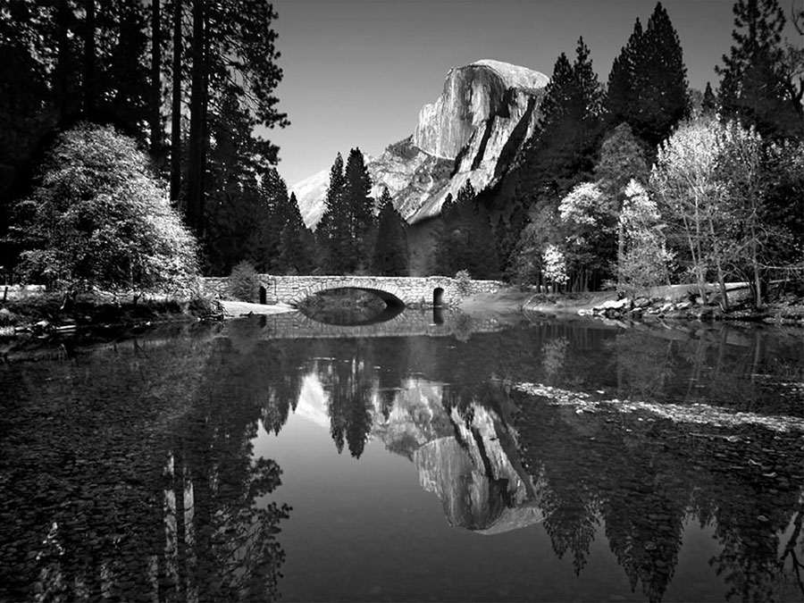

# 🖼️ AI Image Colorizer

[](https://your-app-url.streamlit.app)
[](https://www.python.org/downloads/)
[](https://pytorch.org/)
[](LICENSE)

A modern, user-friendly **Streamlit web application** that brings black and white photos to life using state-of-the-art deep learning colorization models.



## ✨ Features

- 🎨 **Multiple Color Variations**: Generate 4 different styles - Vibrant, Warm, Cool, and Vintage
- 🚀 **GPU Acceleration**: Optional CUDA support for faster processing
- 📊 **Adjustable Quality**: Choose from 256px, 384px, or 512px processing resolution
- 💾 **Easy Downloads**: Download each colorized variation instantly
- 🖼️ **Sample Images**: Built-in test images to try immediately
- 🎯 **Research-Based**: Built on ECCV 2016 and SIGGRAPH 2017 research

## 🚀 Quick Start

### Prerequisites
- Python 3.8 or higher
- CUDA-compatible GPU (optional, for faster processing)

### Installation

1. **Clone the repository**
```bash
git clone https://github.com/soemoenaing-1/Image-Colorizer.git
cd Image-Colorizer
```

2. **Install dependencies**
```bash
pip install -r requirements.txt
pip install streamlit
```

3. **Run the application**
```bash
streamlit run app.py
```

4. **Open your browser** at `http://localhost:8501`

## 🎨 How to Use

1. **Upload an Image**: Drag and drop a black & white photo, or use the built-in sample image
2. **Adjust Settings**: 
   - Choose processing resolution (256px, 384px, 512px)
   - Select number of color variations (1-4)
   - Enable GPU if available
3. **Colorize**: Watch the AI bring your image to life!
4. **Download**: Save your favorite colorized versions

## 🛠️ Technical Details

### Underlying Research
This application is built on groundbreaking research from UC Berkeley:

- **ECCV 2016**: "Colorful Image Colorization" by Zhang, Isola & Efros
- **SIGGRAPH 2017**: "Real-Time User-Guided Image Colorization with Learned Deep Priors"

### Architecture
- **Frontend**: Streamlit web interface
- **Backend**: PyTorch deep learning models
- **Models**: 
  - `eccv16`: Original ECCV 2016 model
  - `siggraph17`: Enhanced SIGGRAPH 2017 model (default)

### Color Variations
| Style | Description |
|-------|-------------|
| **Original** | Pure AI colorization output |
| **Vibrant** | Enhanced saturation & contrast |
| **Warm** | Red/yellow tones for cozy feel |
| **Cool** | Blue tones for calm atmosphere |
| **Vintage** | Muted, faded retro look |
| **Cinematic** | High contrast, dramatic styling |

## 📁 Project Structure

```
Image-Colorizer/
├── app.py                 # Main Streamlit application
├── colorizers/            # AI colorization models
│   ├── eccv16.py         # ECCV 2016 model
│   ├── siggraph17.py     # SIGGRAPH 2017 model
│   ├── base_color.py     # Base model class
│   └── util.py           # Image processing utilities
├── imgs/                 # Sample images for testing
├── requirements.txt      # Python dependencies
├── .gitignore           # Git ignore rules
├── LICENSE              # MIT License
└── README.md            # This file
```

## 🔧 Command Line Usage

For batch processing without the web interface:

```python
import colorizers
from colorizers.util import load_img, preprocess_img, postprocess_tens

# Load model
colorizer = colorizers.siggraph17(pretrained=True).eval()

# Process image
img = load_img('path/to/image.jpg')
# ... (see demo_release.py for full example)
```

```bash
# Direct command line
python demo_release.py -i imgs/ansel_adams3.jpg
```

## 💻 System Requirements

| Component | Minimum | Recommended |
|-----------|---------|-------------|
| Python | 3.8+ | 3.10+ |
| RAM | 4 GB | 8 GB+ |
| GPU | Optional | NVIDIA CUDA |
| Storage | 500 MB | 1 GB+ |

## 🤝 Contributing

Contributions are welcome! Feel free to:
- Report bugs
- Suggest features
- Submit pull requests

## 📄 License

This project is licensed under the MIT License - see the [LICENSE](LICENSE) file for details.

The underlying colorization models are based on research by Richard Zhang, Phillip Isola, and Alexei A. Efros (UC Berkeley).

## 🙏 Acknowledgments

- **Research**: Richard Zhang, Phillip Isola, Alexei A. Efros
- **Institution**: UC Berkeley, BAIR (Berkeley AI Research)
- **Publications**: ECCV 2016, SIGGRAPH 2017

### Citation

If you use this project in your research, please cite:

```bibtex
@inproceedings{zhang2016colorful,
  title={Colorful Image Colorization},
  author={Zhang, Richard and Isola, Phillip and Efros, Alexei A},
  booktitle={ECCV},
  year={2016}
}

@article{zhang2017real,
  title={Real-Time User-Guided Image Colorization with Learned Deep Priors},
  author={Zhang, Richard and Zhu, Jun-Yan and Isola, Phillip and Geng, Xinyang and Lin, Angela S and Yu, Tianhe and Efros, Alexei A},
  journal={ACM Transactions on Graphics (TOG)},
  volume={9},
  number={4},
  year={2017},
  publisher={ACM}
}
```

## 📧 Contact

- **Project Issues**: [GitHub Issues](https://github.com/soemoenaing-1/Image-Colorizer/issues)
- **Research Contact**: rich.zhang at eecs.berkeley.edu (for model questions)

---

⭐ **Star this repo if you find it useful!**
